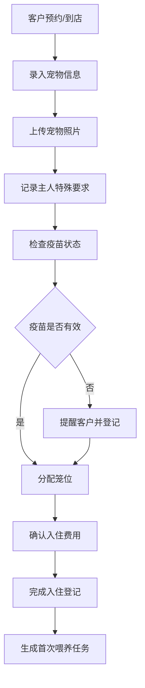
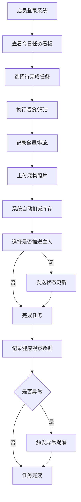
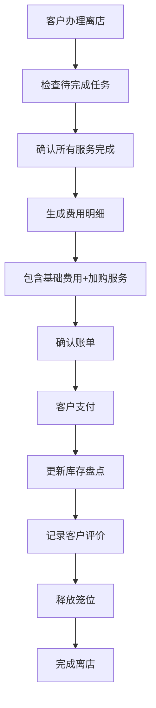

## 1. 产品概述

宠物喂养机构管理系统是为连锁宠物店和家庭寄养点打造的一站式日常运营管理平台，帮助门店高效管理宠物照护全流程，提升服务质量和运营效率。

- **核心价值**：实现宠物入住登记、日常照护、健康监控、库存管理、客户沟通、员工管理和财务结算的全流程数字化
- **目标用户**：宠物店店员、店长、经营者，以及家庭寄养点管理员
- **解决痛点**：纸质记录易丢失、任务分配混乱、客户沟通不及时、库存管理粗放、数据统计困难

## 2. 核心功能

### 2.1 用户角色

| 角色 | 登录方式 | 核心权限 |
|------|----------|----------|
| 店员 | 账号密码登录 | 入住登记、任务执行、健康记录、库存操作、客户沟通、交接备注 |
| 店长 | 账号密码登录 | 员工排班、服务质量查看、投诉处理、账单生成、入住率统计、数据报表 |

### 2.2 功能模块

1. **今日看板**：任务概览、待办提醒、异常告警、入住统计、快捷操作入口
2. **宠物入住**：入住登记、宠物照片上传、主人信息、特殊要求、笼位分配、疫苗信息
3. **喂养任务**：喂食/清洁任务列表、任务状态、食量记录、任务完成确认
4. **健康观察**：体温测量、精神状态、用药记录、洗澡记录、遛放记录、异常提醒
5. **库存耗材**：粮食库存、耗材管理、出入库记录、库存扣减、低库存预警
6. **客户沟通**：消息推送、主人消息、临时加餐请求、服务加购、投诉处理
7. **员工排班**：班次管理、人员分配、交接备注、考勤记录
8. **结算统计**：账单生成、费用明细、入住率统计、门店对比、营收报表

### 2.3 页面详情

| 页面名称 | 模块名称 | 功能描述 |
|----------|----------|----------|
| 今日看板 | 数据概览 | 今日入住/离店数、在住宠物数、待办任务数、异常提醒数 |
| 今日看板 | 待办任务 | 按笼位展示待办任务，支持快速完成和状态切换 |
| 今日看板 | 异常告警 | 疫苗到期、健康异常、低库存等重要提醒 |
| 今日看板 | 快捷操作 | 快速入住、任务登记、消息发送等常用功能入口 |
| 宠物入住 | 入住列表 | 在住宠物列表，支持筛选和搜索 |
| 宠物入住 | 入住登记 | 宠物信息录入、照片上传、主人信息、特殊要求记录 |
| 宠物入住 | 疫苗管理 | 疫苗接种记录、到期提醒 |
| 宠物入住 | 离店确认 | 费用结算、离店手续、评价记录 |
| 喂养任务 | 任务概览 | 今日喂食/清洁任务，按时间段和笼位分组 |
| 喂养任务 | 任务执行 | 记录喂食量、完成状态、备注信息 |
| 喂养任务 | 临时加餐 | 额外喂食请求、费用记录 |
| 健康观察 | 健康记录 | 体温、精神状态、食欲、排便情况记录 |
| 健康观察 | 用药管理 | 用药时间、剂量、药物名称记录 |
| 健康观察 | 服务记录 | 洗澡、遛放、美容等服务记录 |
| 健康观察 | 异常提醒 | 健康指标异常自动告警 |
| 库存耗材 | 库存概览 | 粮食、耗材库存数量，低库存预警 |
| 库存耗材 | 出入库管理 | 采购入库、领用出库、库存盘点 |
| 库存耗材 | 自动扣减 | 喂食任务完成自动扣减对应粮食库存 |
| 客户沟通 | 消息中心 | 主人消息列表、未读提醒 |
| 客户沟通 | 消息推送 | 宠物状态更新、照片发送给主人 |
| 客户沟通 | 服务加购 | 主人申请额外服务，费用确认 |
| 客户沟通 | 投诉处理 | 客户投诉记录、处理进度跟踪 |
| 员工排班 | 排班日历 | 周/月排班视图，班次分配 |
| 员工排班 | 交接管理 | 交接班备注、工作交接记录 |
| 员工排班 | 考勤记录 | 上下班打卡、请假管理 |
| 结算统计 | 账单管理 | 住店账单生成、费用明细、支付记录 |
| 结算统计 | 入住率统计 | 各门店入住率、趋势分析 |
| 结算统计 | 营收报表 | 收入明细、门店对比、图表展示 |
| 结算统计 | 服务质量 | 客户评价、投诉率、任务完成率 |

## 3. 核心流程

### 3.1 宠物入住流程

### 3.2 日常照护流程

### 3.3 离店结算流程

## 4. 用户界面设计

### 4.1 设计风格

- **主色调**：温暖橙色 `#FF7A45`（代表活力、关爱），配合深绿色 `#2D6A4F`（代表健康、自然）
- **辅助色**：柔和的米色背景 `#FFF8F0`，卡片白色 `#FFFFFF`，边框浅灰 `#E5E7EB`
- **状态色**：成功绿 `#10B981`，警告黄 `#F59E0B`，危险红 `#EF4444`，信息蓝 `#3B82F6`
- **按钮风格**：圆角 8px，微立体阴影，hover 时轻微上浮动画
- **字体**：标题使用 "Noto Sans SC" 粗体，正文使用 "Noto Sans SC" 常规体
- **布局风格**：左侧导航栏 + 顶部状态栏 + 主内容区的经典管理后台布局，卡片式内容展示
- **图标风格**：使用 Linear 风格图标，配合可爱的宠物元素 emoji 🐕🐈

### 4.2 页面设计概述

| 页面名称 | 模块名称 | UI 元素 |
|----------|----------|----------|
| 今日看板 | 数据概览 | 彩色统计卡片，带图标和趋势箭头，悬停动画 |
| 今日看板 | 待办任务 | 时间轴布局，笼位卡片，任务状态标签，快速操作按钮 |
| 今日看板 | 异常告警 | 醒目的警告卡片，带闪烁动画，优先级标识 |
| 宠物入住 | 入住列表 | 表格 + 卡片混合布局，宠物头像，状态标签，筛选栏 |
| 宠物入住 | 入住表单 | 分步向导，照片上传预览区，表单验证提示 |
| 喂养任务 | 任务列表 | 按时间段分组的卡片列表，进度条，完成勾选动画 |
| 健康观察 | 记录表单 | 体温曲线图，状态选择器，用药时间轴 |
| 库存耗材 | 库存概览 | 库存卡片，进度条显示库存占比，低库存红色高亮 |
| 客户沟通 | 消息中心 | 对话式界面，未读红点，快捷回复模板 |
| 员工排班 | 排班日历 | 月历视图，色块区分班次，拖拽调整功能 |
| 结算统计 | 数据报表 | 柱状图、折线图、饼图组合，数据钻取功能 |

### 4.3 响应式设计

- **设计原则**：Desktop-first，兼顾平板和大屏显示
- **断点设置**：1280px（桌面）、1024px（平板横屏）、768px（平板竖屏）
- **侧边栏**：小于 1024px 时自动收起为图标模式，支持展开/收起
- **表格**：小屏幕下转为卡片式展示，避免横向滚动
- **触控优化**：按钮最小高度 44px，关键操作区增加触控反馈

### 4.4 动效设计

- **页面加载**：骨架屏 + 渐入动画，内容区块交错显示
- **任务完成**：勾选后绿色对勾缩放动画，卡片轻微上浮淡出
- **异常提醒**：新告警出现时从右侧滑入，带轻微脉冲动画
- **导航切换**：平滑过渡动画，当前项高亮指示条滑动
- **数据更新**：数字变化时滚动计数动画，图表数据渐入
