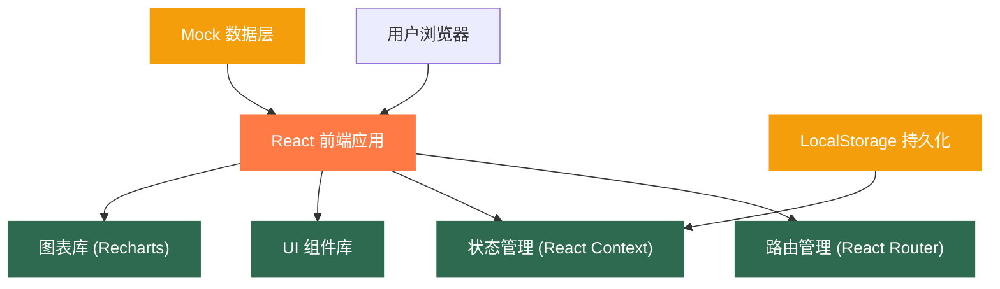
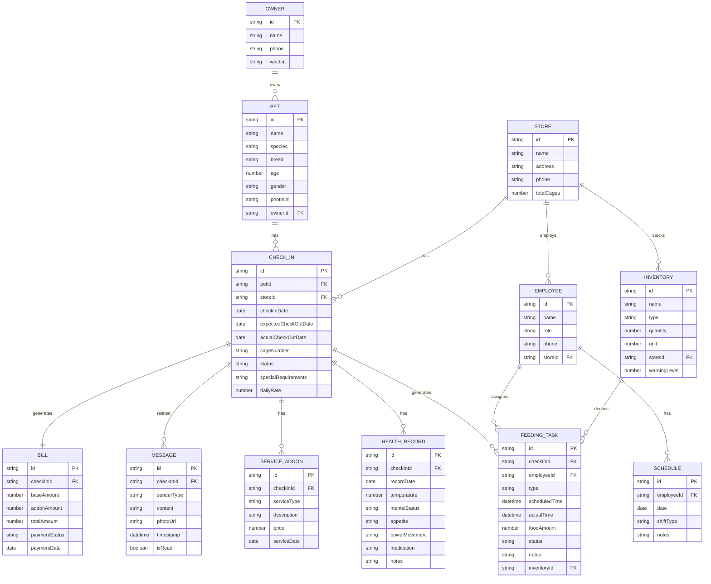

## 1. 架构设计



## 2. 技术描述

- **前端框架**: React@18 + TypeScript
- **构建工具**: Vite@5
- **样式方案**: TailwindCSS@3 + PostCSS
- **路由管理**: React Router Dom@6
- **状态管理**: React Context + useReducer
- **图表组件**: Recharts@2
- **图标库**: Lucide React
- **数据持久化**: LocalStorage
- **数据方案**: Mock 数据（内置模拟数据，支持离线使用）

## 3. 目录结构

```
src/
├── components/          # 公共组件
│   ├── layout/         # 布局组件（侧边栏、顶部栏）
│   ├── common/         # 通用组件（按钮、卡片、表单等）
│   └── charts/         # 图表组件
├── pages/              # 页面组件
│   ├── Dashboard/      # 今日看板
│   ├── CheckIn/        # 宠物入住
│   ├── Feeding/        # 喂养任务
│   ├── Health/         # 健康观察
│   ├── Inventory/      # 库存耗材
│   ├── Communication/  # 客户沟通
│   ├── Schedule/       # 员工排班
│   └── Statistics/     # 结算统计
├── context/            # 状态管理
│   ├── AppContext.tsx
│   └── reducers/
├── data/               # Mock 数据
│   ├── mockData.ts
│   └── types.ts
├── hooks/              # 自定义 Hooks
│   └── useLocalStorage.ts
├── utils/              # 工具函数
│   ├── formatters.ts
│   └── validators.ts
├── App.tsx
├── main.tsx
└── index.css
```

## 4. 路由定义

| 路由路径 | 页面名称 | 说明 |
|----------|----------|------|
| / | 今日看板 | 首页，数据概览和待办任务 |
| /checkin | 宠物入住 | 入住列表和登记管理 |
| /checkin/new | 新增入住 | 入住登记表单 |
| /feeding | 喂养任务 | 今日任务列表和执行 |
| /health | 健康观察 | 健康记录和观察数据 |
| /inventory | 库存耗材 | 库存管理和出入库 |
| /communication | 客户沟通 | 消息中心和客户交互 |
| /schedule | 员工排班 | 排班管理和交接 |
| /statistics | 结算统计 | 账单和数据报表 |

## 5. 数据模型

### 5.1 实体关系图



### 5.2 核心类型定义

```typescript
// 宠物信息
interface Pet {
  id: string;
  name: string;
  species: 'dog' | 'cat' | 'other';
  breed: string;
  age: number;
  gender: 'male' | 'female';
  weight?: number;
  photoUrl: string;
  ownerId: string;
  vaccineRecords: VaccineRecord[];
}

// 疫苗记录
interface VaccineRecord {
  id: string;
  name: string;
  date: string;
  nextDate: string;
  isExpired: boolean;
}

// 入住记录
interface CheckIn {
  id: string;
  petId: string;
  storeId: string;
  checkInDate: string;
  expectedCheckOutDate: string;
  actualCheckOutDate?: string;
  cageNumber: string;
  status: 'active' | 'completed' | 'cancelled';
  specialRequirements: string;
  dailyRate: number;
  deposit: number;
}

// 喂养任务
interface FeedingTask {
  id: string;
  checkInId: string;
  employeeId: string;
  type: 'feeding' | 'water' | 'cleaning' | 'walk' | 'bath' | 'medication';
  scheduledTime: string;
  actualTime?: string;
  foodAmount?: number;
  status: 'pending' | 'in-progress' | 'completed' | 'cancelled';
  notes?: string;
  inventoryId?: string;
  photoUrl?: string;
  notifyOwner?: boolean;
}

// 健康记录
interface HealthRecord {
  id: string;
  checkInId: string;
  recordDate: string;
  temperature: number;
  mentalStatus: 'excellent' | 'good' | 'normal' | 'poor' | 'critical';
  appetite: 'excellent' | 'good' | 'normal' | 'poor' | 'none';
  bowelMovement: 'normal' | 'soft' | 'diarrhea' | 'constipated' | 'none';
  medication?: string;
  notes?: string;
  isAbnormal: boolean;
}

// 库存项目
interface InventoryItem {
  id: string;
  name: string;
  type: 'food' | 'snack' | 'supply' | 'medicine';
  quantity: number;
  unit: string;
  warningLevel: number;
  storeId: string;
  lastUpdated: string;
}

// 消息
interface Message {
  id: string;
  checkInId: string;
  senderType: 'staff' | 'owner' | 'system';
  senderName: string;
  content: string;
  photoUrl?: string;
  timestamp: string;
  isRead: boolean;
}

// 员工
interface Employee {
  id: string;
  name: string;
  role: 'staff' | 'manager';
  phone: string;
  storeId: string;
  avatarUrl?: string;
}

// 排班
interface Schedule {
  id: string;
  employeeId: string;
  date: string;
  shiftType: 'morning' | 'afternoon' | 'night' | 'off';
  notes?: string;
  handoverNotes?: string;
}

// 账单
interface Bill {
  id: string;
  checkInId: string;
  baseAmount: number;
  addonAmount: number;
  discount: number;
  totalAmount: number;
  paymentStatus: 'pending' | 'paid' | 'refunded';
  paymentDate?: string;
  paymentMethod?: string;
  items: BillItem[];
}

// 账单明细
interface BillItem {
  id: string;
  description: string;
  quantity: number;
  unitPrice: number;
  amount: number;
}

// 门店
interface Store {
  id: string;
  name: string;
  address: string;
  phone: string;
  totalCages: number;
  occupiedCages: number;
}
```

### 5.3 Mock 数据初始化

系统将内置以下模拟数据以支持完整功能演示：

- 3 家门店信息
- 15 只在住宠物（含照片、主人信息）
- 50+ 条喂养任务
- 30+ 条健康记录
- 20+ 种库存商品
- 8 名员工信息
- 2 周排班数据
- 10+ 条客户消息
- 5 份历史账单
